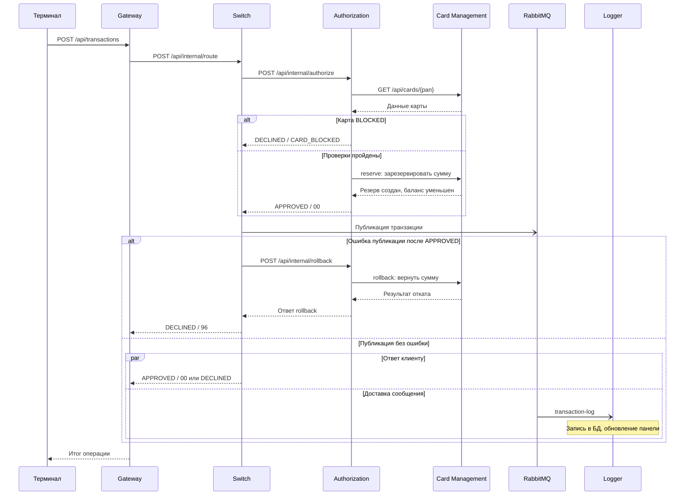

# А4. Путь транзакции

**Не хватало:** веток отказа и отката после ошибки публикации.
**Добавлено:** успешная покупка, отказ по заблокированной карте и откат при ошибке публикации.

```mermaid
sequenceDiagram
    participant T as Терминал
    participant G as Gateway
    participant S as Switch
    participant A as Authorization
    participant C as Card Management
    participant R as RabbitMQ
    participant L as Logger
    T->>G: POST /api/transactions
    G->>S: POST /api/internal/route
    S->>A: POST /api/internal/authorize
    A->>C: GET /api/cards/{pan}
    C-->>A: Данные карты
    alt Карта BLOCKED
        A-->>S: DECLINED / CARD_BLOCKED
    else Проверки пройдены
        A->>C: reserve: зарезервировать сумму
        C-->>A: Резерв создан, баланс уменьшен
        A-->>S: APPROVED / 00
    end
    S-)R: Публикация транзакции
    alt Ошибка публикации после APPROVED
        S->>A: POST /api/internal/rollback
        A->>C: rollback: вернуть сумму
        C-->>A: Результат отката
        A-->>S: Ответ rollback
        S-->>G: DECLINED / 96
    else Публикация без ошибки
        par Ответ клиенту
            S-->>G: APPROVED / 00 или DECLINED
        and Доставка сообщения
            R-)L: transaction-log
            Note over L: Запись в БД, обновление панели
        end
    end
    G-->>T: Итог операции
```
